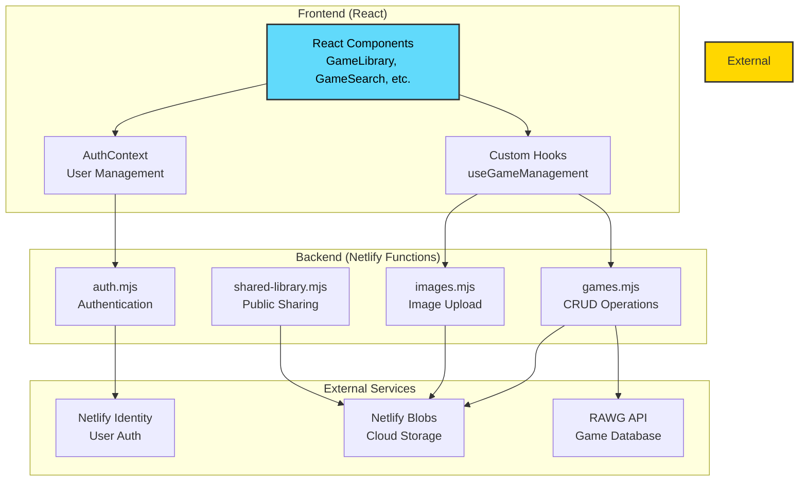

# 🎮 My Gaming Library

A modern, cloud-based gaming library management application built with React and Netlify. Catalog, organize, and share your video game collection across all platforms with ease.

**Live Demo**: [Visit My Gaming Library](https://mygaminglibrary.netlify.app)

## 📊 Architecture



## 🎮 Features

### Library Management

- 🔍 **Search & Add Games**: Search thousands of games using the RAWG Video Games Database API
- ✍️ **Manual Entry**: Add games manually with custom details and images
- 🕹️ **Multi-Platform Support**: Track games across PlayStation, Xbox, Nintendo, PC, and mobile platforms
- 📝 **Rich Game Details**: Store game info including title, description, genre, release date, publisher, player count, and cover art
- 🖼️ **Image Management**: Upload custom game covers or fetch them automatically from the API
- ✏️ **Full CRUD Operations**: Edit and delete games to manage your library

### Wishlist System

- ❤️ **Mark Favorites**: Add games to your wishlist with an animated heart indicator
- 📖 **Separate Wishlist View**: Filter and view only your wishlisted games
- 📥 **Export Options**: Export your wishlist to CSV or PDF formats
- 🔗 **Shareable Wishlists**: Generate public links to share your wishlist with friends

### Sharing & Export

- 🌐 **Public Library Links**: Generate shareable links to display your entire collection
- 📤 **Export Formats**: Download your collection as CSV or PDF
- 🔐 **Access Control**: Share collections via generated links while keeping your account private
- 📱 **Responsive Display**: Collections look great on all devices

### User Experience

- 🎯 **Guided Tour**: Interactive onboarding for new users
- ⚡ **Loading States**: Smooth loading animations and shimmer effects
- 📱 **Responsive Design**: Works seamlessly on desktop and mobile devices
- 🔔 **Toast Notifications**: User-friendly feedback for all actions
- 👨‍💼 **Admin Features**: Special administrative controls for authorized users
- 📸 **Barcode Scanning**: Scan game barcodes to quickly add games to your library

## 🛠️ Tech Stack

### Frontend
- **React 19.2.1** - Modern React with hooks and context API
- **Vite** - Ultra-fast build tool and development server
- **Lucide React** - Beautiful, consistent icon library
- **CSS3** - Custom styling with animations and transitions
- **Quagga2** - Barcode scanning library

### Backend & Deployment
- **Netlify Functions** - Serverless API endpoints (Node.js runtime)
- **Netlify Blobs** - Cloud storage for game data and images
- **Netlify Identity** - User authentication and authorization
- **Netlify Hosting** - Fast CDN-based hosting

### External APIs & Services
- **RAWG Video Games Database API** - Comprehensive game database with 500k+ games
- **Netlify Identity Widget** - Authentication UI components

### Development Tools
- **Node.js** - JavaScript runtime
- **npm** - Package management
- **Netlify CLI** - Local development and deployment

## 📦 Installation

## 🎯 Quick Start

### Prerequisites
- Node.js v14+ 
- npm or yarn
- Netlify CLI
- RAWG API key (free from [rawg.io](https://rawg.io/apidocs))

### Installation

1. **Clone & Setup**
   ```bash
   git clone <repository-url>
   cd mygaminglibrary
   npm install
   ```

2. **Configure Environment**
   ```bash
   cp .env.example .env.local
   # Edit .env.local and add your RAWG_API_KEY
   ```

3. **Run Locally**
   ```bash
   npm run dev              # Frontend only (port 5173)
   # or
   netlify dev              # Full stack with Functions (port 8888)
   ```

4. **Build & Deploy**
   ```bash
   npm run build
   npm run deploy
   ```

For detailed setup instructions, see [Installation](#-installation) below.

## 📦 Installation

### Prerequisites
- Node.js (v14 or higher)
- npm or yarn
- Netlify account (for deployment)
- RAWG API key ([Get one here](https://rawg.io/apidocs))

### Local Setup

1. **Clone the repository**

   ```bash
   git clone <repository-url>
   cd mygaminglibrary
   ```

2. **Install dependencies**

   ```bash
   npm install
   ```

3. **Set up environment variables**

   Create a `.env.local` file in the root directory:

   ```env
   VITE_RAWG_API_KEY=your_rawg_api_key_here
   ```

4. **Install Netlify CLI** (if not already installed)

   ```bash
   npm install -g netlify-cli
   ```

5. **Log in to Netlify**

   ```bash
   netlify login
   ```

6. **Link to Netlify site**

   ```bash
   netlify link
   ```

7. **Run the development server**

   ```bash
   npm run dev
   ```

   The app will be available at `http://localhost:5173`

### Development with Netlify Functions

To test with Netlify Functions locally:

```bash
netlify dev
```

This runs the full stack including Functions at `http://localhost:8888`

## 🚀 Deployment

### Deploy to Netlify

1. **Build the project**

   ```bash
   npm run build
   ```

2. **Deploy**
   ```bash
   npm run deploy
   ```

### Environment Variables in Netlify

Set these in your Netlify dashboard under **Site settings → Environment variables**:

- `VITE_RAWG_API_KEY`: Your RAWG API key

### Configure Netlify Identity

1. Enable Netlify Identity in your site dashboard
2. Configure registration preferences (invite-only or open)
3. Run the setup script if needed:
   ```bash
   node setup-auth.js
   ```

## 📁 Project Structure

```
mygaminglibrary/
├── netlify/
│   └── functions/              # Serverless API endpoints
│       ├── auth.mjs            # Authentication handlers
│       ├── games.mjs           # Game CRUD operations
│       ├── images.mjs          # Image upload/management
│       ├── rawg.mjs            # RAWG API proxy
│       ├── shared-library.mjs  # Public sharing endpoints
│       └── shared-library.mjs  # Shared utilities
├── src/
│   ├── components/             # React components
│   │   ├── GameLibrary.jsx     # Main library view
│   │   ├── GameSearch.jsx      # Game search interface
│   │   ├── GameForm.jsx        # Add/edit game form
│   │   ├── GameModal.jsx       # Game details modal
│   │   ├── SharedLibrary.jsx   # Public library view
│   │   ├── BarcodeScanner.jsx  # Barcode scanning
│   │   ├── Login.jsx           # Authentication UI
│   │   └── ...
│   ├── contexts/
│   │   └── AuthContext.jsx     # Authentication context
│   ├── hooks/
│   │   └── useGameManagement.js # Game operations hook
│   ├── utils/
│   │   ├── persistentAuth.js   # Auth persistence
│   │   └── rawgApi.js          # RAWG API client
│   ├── graphql/                # GraphQL queries
│   ├── App.jsx                 # Main application component
│   └── index.jsx               # Application entry point
├── public/                     # Static assets
├── netlify.toml               # Netlify configuration
├── package.json               # Dependencies and scripts
├── vite.config.js             # Vite configuration
└── .gitignore                 # Git ignore rules
```

## 🎯 Available Scripts

| Script | Purpose |
|--------|---------|
| `npm run dev` | Start development server (port 5173) |
| `npm run build` | Build for production |
| `npm run preview` | Preview production build |
| `npm run deploy` | Deploy to Netlify production |
| `npm run netlify:dev` | Run with Netlify Functions locally |
| `npm run netlify:login` | Authenticate with Netlify |
| `npm run netlify:link` | Link to Netlify site |

## 🔒 Authentication

The app uses Netlify Identity for user authentication:

- Users must sign up/log in to access the library
- Each user has their own private collection
- Admin roles can be assigned for special permissions
- Shared libraries are publicly accessible via generated links

## 📖 Usage Guide

### 🎮 Adding Games

**Via Search:**
1. Use the search bar to find a game from the RAWG database
2. Click on a game from the search results
3. Select the platform and adjust any details
4. Click **Save** to add to your library

**Manually:**
1. Click **"Add Game Manually"**
2. Fill in game details (title, description, etc.)
3. Upload a cover image (optional - can use a placeholder)
4. Click **Save** to add to library

**Via Barcode:**
1. Click the barcode scanner icon
2. Point your camera at a game barcode
3. The game will be auto-detected and added

### 📚 Managing Your Library

| Action | How To |
|--------|--------|
| **Edit** | Click the ✏️ edit icon on any game card |
| **Delete** | Click the 🗑️ delete icon to remove a game |
| **Wishlist** | Click the ❤️ heart icon to add/remove from wishlist |
| **View Details** | Click on a game card to see full information |
| **Filter** | Switch between "All Games" and "Wishlist" views |

### 🔗 Sharing Your Collection

1. Click **"Share Library"** button to generate a public link
2. Click **"Share Wishlist"** to share only your wishlisted games
3. Copy and share the generated URL with anyone
4. Recipients can view but not edit your collection

### 💾 Exporting Wishlist

1. Click **"Export Wishlist"** button
2. Choose format:
   - **CSV** - For use in spreadsheet applications
   - **PDF** - For printing or viewing as a document
3. File will download to your downloads folder

### 🎯 Using Guided Tour

New users will see an interactive guided tour on first login. You can restart it anytime from the settings menu.

## 🤝 Contributing

Contributions are welcome! Please feel free to:
- Report bugs by opening an issue
- Suggest new features and improvements
- Submit pull requests with enhancements
- Help improve documentation

## 📄 License

This project is licensed under the MIT License - see the LICENSE file for details.

## 🙏 Acknowledgments

- **Game Data**: [RAWG Video Games Database](https://rawg.io/) - Comprehensive game information
- **Icons**: [Lucide](https://lucide.dev/) - Beautiful, consistent icon library
- **Hosting**: [Netlify](https://www.netlify.com/) - Fast hosting and serverless functions
- **Barcode Scanning**: [Quagga2](https://serratus.github.io/quagga2/) - JavaScript barcode reader

## 📚 Additional Resources

- [React Documentation](https://react.dev)
- [Vite Guide](https://vitejs.dev)
- [Netlify Functions](https://docs.netlify.com/functions/overview/)
- [Netlify Identity](https://docs.netlify.com/identity/overview/)
- [RAWG API Documentation](https://rawg.io/apidocs)

## 📞 Support & Feedback

- **Report Issues**: Open an issue on GitHub
- **Suggestions**: Discussions or feature requests welcome
- **Questions**: Check existing issues or documentation first

## 🚀 Roadmap

Future enhancements planned:
- [ ] Advanced filtering and sorting options
- [ ] Game reviews and ratings
- [ ] Multiplayer statistics tracking
- [ ] Achievement tracking
- [ ] Integration with streaming platforms
- [ ] Mobile app version

---

**Made with ❤️ for gamers by a gamer**
